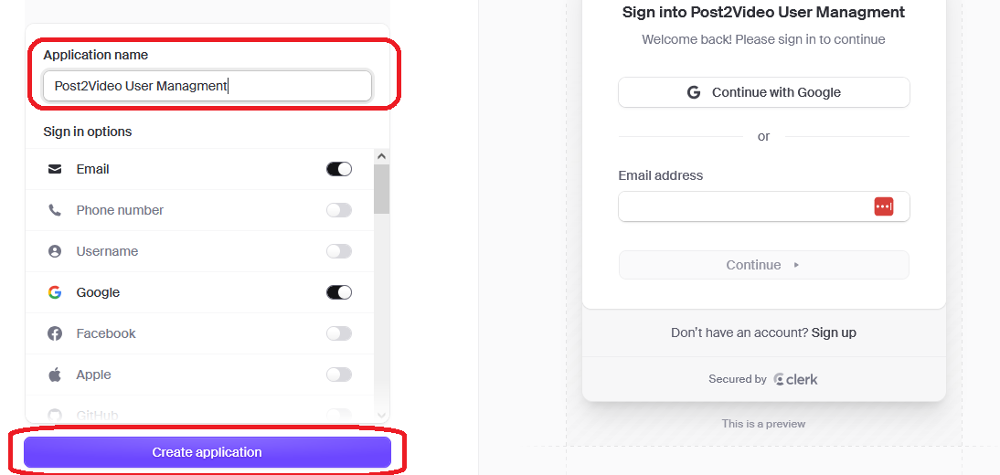
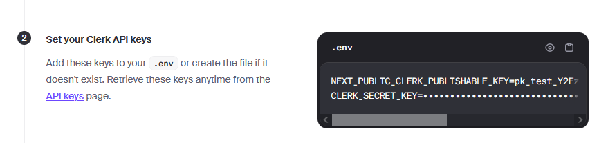
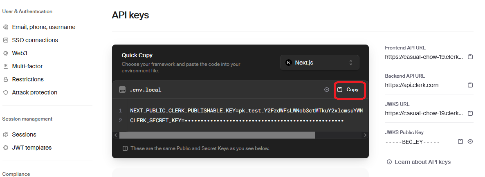
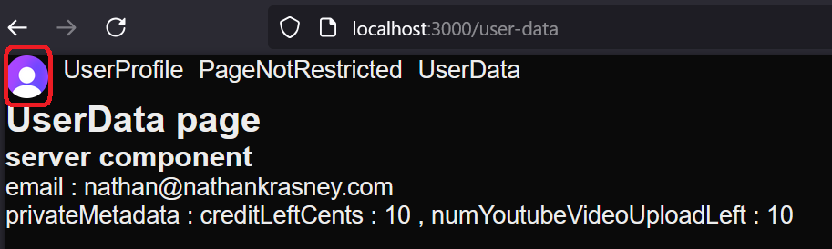
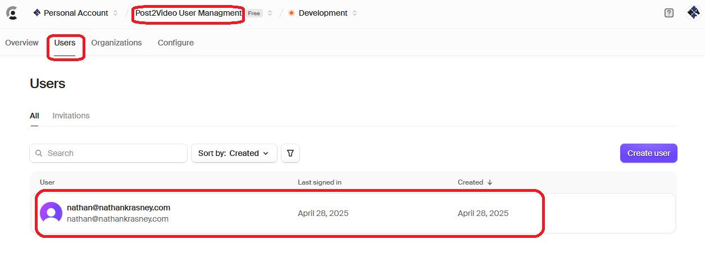
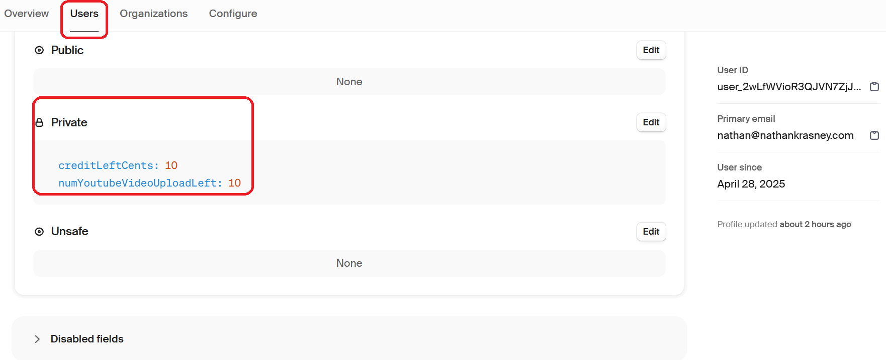

<h1>Project Name</h1>
<p>Use Clerk easily for user management of your Next.js App Router app.</p>


<h2>Project Description</h2>
<p>This repository demonstrates the implementation of user management with Clerk in a Next.js 15 App Router application, showcasing features like authentication, route protection, and user-specific data management, particularly for a free tier in the post2video app.</p>

<p>It includes the following:</p>

<ul>
  <li>Login / logout using user / password, social login, and more - done very easily via Clerk button and form.</li>
  <li>Restrict pages to require login - done very easily via Clerk and the <code>middleware.ts</code> file.</li>
  <li>Read and write to the user private data - done easily using Clerk (with Zod help).</li>
</ul>

<h2>My Motivation</h2>

<h3>Current status</h3>
<p>I have passed Google OAuth verification for post2video and now I want to ask for x100 more quota. I want first to have some user management to have a basic app still without payment, but I do want the free tier (e.g., up to 6 videos, total videos 20 minutes, and total spend 20 cents) mode so Google can see the product.</p>

<h3>User management</h3>
<p>To handle the free tier, I need user management which includes the following:</p>
<ul>
  <li>Store the user signup info, e.g., user email / password.</li>
  <li>Store the user metadata: number of uploaded videos, consumed cents.</li>
  <li>Maybe handle user roles: admin, user (free tier, free tier expired?).</li>
</ul>

<h3>Constraints</h3>
<ul>
  <li>I prefer a free tool that handles users on its side for up to a few thousand users.</li>
  <li>I use Next.js 15 with the App Router.</li>
  <li>My app post2video uses the YouTube API, and to use it, you need to authenticate using Google OAuth2.</li>
</ul>

<h2>Installation</h2>

<h3><a href="https://clerk.com">clerk</a></h3>

<h4>Step 1: Sign up and create app</h4>
<p>Notice that the checkboxes are set by default.</p>


<h4>Step 2: Set your Clerk API keys</h4>

<p>And copy to <code>.env.local</code>:</p>


<h4>Step 3: Install @clerk/nextjs</h4>
<pre><code>pnpm add @clerk/nextjs</code></pre>

<h4>Step 4: Add <code>clerkMiddleware()</code> to your app</h4>
<p>Create a default <code>middleware.ts</code> file in the <code>src</code> root. It will match all pages but allow navigation to all.</p>
<p><strong>Remark:</strong> <code>clerkMiddleware</code> will be changed later.</p>


```ts
import { clerkMiddleware } from "@clerk/nextjs/server";

export default clerkMiddleware();

export const config = {
  matcher: [
    // Skip Next.js internals and all static files, unless found in search params
    "/((?!_next|[^?]*\\.(?:html?|css|js(?!on)|jpe?g|webp|png|gif|svg|ttf|woff2?|ico|csv|docx?|xlsx?|zip|webmanifest)).*)",
    // Always run for API routes
    "/(api|trpc)(.*)",
  ],
};
```

<h4>step 5 : Add <ClerkProvider> and Clerk components to your app</h4>

```ts
import type { Metadata } from "next";
import {
  ClerkProvider,
  SignInButton,
  SignUpButton,
  SignedIn,
  SignedOut,
  UserButton,
} from "@clerk/nextjs";
import { Geist, Geist_Mono } from "next/font/google";
import "./globals.css";

const geistSans = Geist({
  variable: "--font-geist-sans",
  subsets: ["latin"],
});

const geistMono = Geist_Mono({
  variable: "--font-geist-mono",
  subsets: ["latin"],
});

export const metadata: Metadata = {
  title: "Clerk Next.js Quickstart",
  description: "Generated by create next app",
};

export default function RootLayout({
  children,
}: Readonly<{
  children: React.ReactNode;
}>) {
  return (
    <ClerkProvider>
      <html lang="en">
        <body
          className={`${geistSans.variable} ${geistMono.variable} antialiased`}
        >
          <header>
            <SignedOut>
              <SignInButton />
              <SignUpButton />
            </SignedOut>
            <SignedIn>
              <UserButton />
            </SignedIn>
          </header>
          {children}
        </body>
      </html>
    </ClerkProvider>
  );
}
```

<h2>Usage</h2>

Run the devlopment server

```bash
npm run dev
```

<h2>Technologies Used</h2>
<ul>
  <li>Clerk</li>
  <li>Next.js App Router</li>
  <li>Zod</li>
  <li>TypeScript</li>
</ul>


<h2>Design</h2>
<p>These are questions that I asked myself before I started:</p>

<h3>Which tool for user management?</h3>
<p>Given Next.js, Clerk is probably the best choice.</p>

<h3>Sign up to post2video with YouTube Gmail account only?</h3>
<p>No:</p>
<ul>
  <li>This will increase friction.</li>
  <li>Will not eliminate malicious free tier users.</li>
  <li>Will not help with later Google OAuth (may even complicate it).</li>
  <li>This is stored, thus contradicting the fact that Google API info is not stored as claimed in the <a href='https://www.post2youtube.com/privacy-policy'>privacy policy</a>.</li>
</ul>
<p>Do not restrict the suggested signup options. Note that for user / password, Clerk verifies your email by default by sending you a few digit number which you first use to login.</p>

<h3>Should I ask for the Google OAuth screen after Clerk sign up?</h3>
<p>No, the first two steps do not require it, so delay until required and the user gains confidence and likes the app.</p>

<h3>Any relation between Clerk and Google OAuth for YouTube API?</h3>
<p>Clerk and Google OAuth for accessing Google services (like YouTube API) are strictly separate processes that serve different purposes.</p>

<p>Here's a concise recap:</p>

<h4>Clerk</h4>
<p>Manages the authentication and user identity within your Post2Video application. It handles who your users are, their sign-in methods (including Google Sign-in as an option), and their sessions within your app. Clerk verifies user identities.</p>

<h4>Google OAuth (for YouTube API)</h4>
<p>Manages authorization for your application to access a user's Google/YouTube account and data on their behalf. It's about what your app is permitted to do with the user's Google account (e.g., upload videos, manage playlists). This requires explicit consent from the user through Google's consent screen.</p>

<h3>Should I use roles?</h3>
<p>Roles like admin / user are supported in Clerk, but currently, I don't see a reason to use them because my use case seems rather simple. However, if required, they can be used.</p>

<h3>Should I put non-user info in Clerk user metadata?</h3>
<p>E.g., credit consumed per user, number of videos uploaded per user.</p>
<p>In this way, I will not need my own storage (e.g., MongoDB) which requires:</p>
<ul>
  <li>Install</li>
  <li>Backup</li>
  <li>Access</li>
</ul>
<p>Thus, development is faster this way, and showing some solution before asking for quota seems good enough.</p>

<p>Check Gemini:</p>
<blockquote>
  <p>Storing user-specific data like <code>credit consumed</code> and <code>number of videos upload per user</code> in Clerk's metadata (either <code>publicMetadata</code> or <code>privateMetadata</code>) is recommended for several key reasons:</p>
  <ul>
    <li>
      <strong>User-Centric Nature:</strong> This information, while not directly related to authentication, describes the state and attributes of a specific user within your application. It reflects their usage, entitlements, or progress.
    </li>
    <li>
      <strong>Accessibility:</strong> Clerk's user object, which is readily available on both the frontend and backend after authentication, provides a convenient and centralized location to access this user-specific state. This simplifies data retrieval when you need to display this information to the user or make decisions based on it in your application logic.
    </li>
    <li>
      <strong>Simplified Data Management:</strong> Keeping this data tied to the user object in Clerk reduces the need for separate database lookups in many common scenarios. When you have the authenticated user via Clerk, you also have their associated credit or upload count.
    </li>
    <li>
      <strong>Integration with Clerk's Ecosystem:</strong> Clerk's triggers and hooks can be used to automate updates to this metadata based on user actions (e.g., deducting credit after a transaction, decrementing uploads after a successful upload). This allows you to manage user state directly within the Clerk workflow.
    </li>
    <li>
      <strong>Appropriate Storage:</strong> Clerk's <code>metadata</code> fields are specifically designed for storing this kind of application-specific data associated with a user. The 8KB limit per user for metadata is generally sufficient for these types of values.
    </li>
  </ul>
  <p>In essence, Clerk becomes the central authority not just for <em>who</em> the user is, but also for key aspects of <em>what</em> that user has access to or has remaining within your application. This tight coupling simplifies development and data management for user-specific state.</p>
</blockquote>

<h4>Clerk rate limit</h4>
<p>Note that Clerk has a rate limit, but it seems that I am not violating it. It will be great if I have 10 users per minute, and even this way, each will need to make 10 API requests per minute to violate the free tier. During the start of the project, 10 users per minute seems very optimistic, and if I violate it, it means I'm getting money, so I'll switch to a Clerk paid plan:</p>
<blockquote>
  <p>For metadata updates (what you care about), Clerk’s public docs say:</p>
  <p>Free plan:<br>→ 100 API requests per minute per project.</p>
  <p>Paid plans (Starter, Business):<br>→ Higher limits, like 300–1000+ API requests per minute (depends on your plan).</p>
</blockquote>

<h3>Where to put per user info in Clerk user metadata: public or private?</h3>
<p>E.g., credit consumed per user, number of videos uploaded per user.</p>
<p>Put in <code>privateMetadata</code> because this can be accessed only on the server. You do not want it to appear on the client as it might get tampered with.</p>


<h2>Code Structure</h2>

<h3>set / get user info</h3>

<h4>get</h4>

```ts
export async function getPrivateMetadata(): Promise<IPrivateUserData | null> {
  const user = await getUser();

  if (!user) {
    throw new Error("user does not exist - you need to sign in");
  }

  if (!user.privateMetadata) {
    return null;
  }

  const privateData = privateUserDataSchema.parse(user.privateMetadata);

  return privateData;
}
```

<h4>set</h4>

```ts
export async function setPrivateMetadata(
  userData: IPrivateUserData
): Promise<void> {
  const client = await clerkClient();

  const { userId } = await auth();
  if (!userId) {
    throw new Error("userId does not exist - you need to sign in");
  }

  const data: UserPrivateMetadata = { ...userData };

  const updatedUser = await client.users.updateUserMetadata(userId, {
    privateMetadata: data,
  });
}
```

<h3>Protecting routes / pages</h3>
<p>There are three options: middleware, client-side (using the <code>useUser</code> hook), server-side (using <code>getAuth</code>).</p>
<p>Middleware is recommended by Clerk, e.g., like this:</p>
<p>This will require authentication from all pages except <code>/</code> and <code>/page-not-restricted</code>.</p>

```ts
import { clerkMiddleware, createRouteMatcher } from "@clerk/nextjs/server";

const isPublicRoute = createRouteMatcher(["/", "/page-not-restricted"]);

export default clerkMiddleware(async (auth, req) => {
  if (!isPublicRoute(req)) {
    await auth.protect();
  }
});

export const config = {
  matcher: [
    // Skip Next.js internals and all static files, unless found in search params
    "/((?!_next|[^?]*\\.(?:html?|css|js(?!on)|jpe?g|webp|png|gif|svg|ttf|woff2?|ico|csv|docx?|xlsx?|zip|webmanifest)).*)",
    // Always run for API routes
    "/(api|trpc)(.*)",
  ],
};
```

<h2>Demo</h2>

<h3>UI</h3>
<p>The UI has four pages:</p>
<ul>
  <li>Home - no login required</li>
  <li>PageNotRestricted - no login required</li>
  <li>UserDate - login required<br>Here, I use the set / get functions of the user private data.</li>
  <li>UserProfile - login required</li>
</ul>
<p>You can log in / log out via the person icon (circled in red).</p>


<h3>Registered users in dashboard</h3>
<p>You can view and edit from the dashboard.</p>


<h3>Private data in dashboard</h3>
<p>You can see the user data in the dashboard.</p>


<h2>Points of Interest</h2>
<ul>
  <li>Getting from <code>UserPrivateMetadata</code> to <code>IPrivateUserData</code> is done via Zod. I was not able to solve it via <code>global.d.ts</code>.</li>
</ul>


<h2>Future work</h2>
<ul>
  <li>Consider using roles: admin, user. It's not clear if I need it, and if I need also other roles, e.g., user in free tier / user in pay tier / expired free tier / expired pay tier (there is a nice video by Web Dev Simplified about handling permissions like a senior dev), check <a href='http://www.youtube.com/watch?v=5GG-VUvruzE'>here</a>.</li>
  <li>Handle production according to <a href='https://clerk.com/docs/deployments/overview'>Deploy your Clerk app to production</a>.</li>
  <li>Consider set / get of the private data member. Can it be very useful and can it eliminate logic errors?</li>
</ul>

<h2>References</h2>
<ul>
  <li><a href='https://clerk.com/docs/quickstarts/nextjs#install-clerk-nextjs'>Clerk Quick Start for Next.js</a></li>
</ul>
